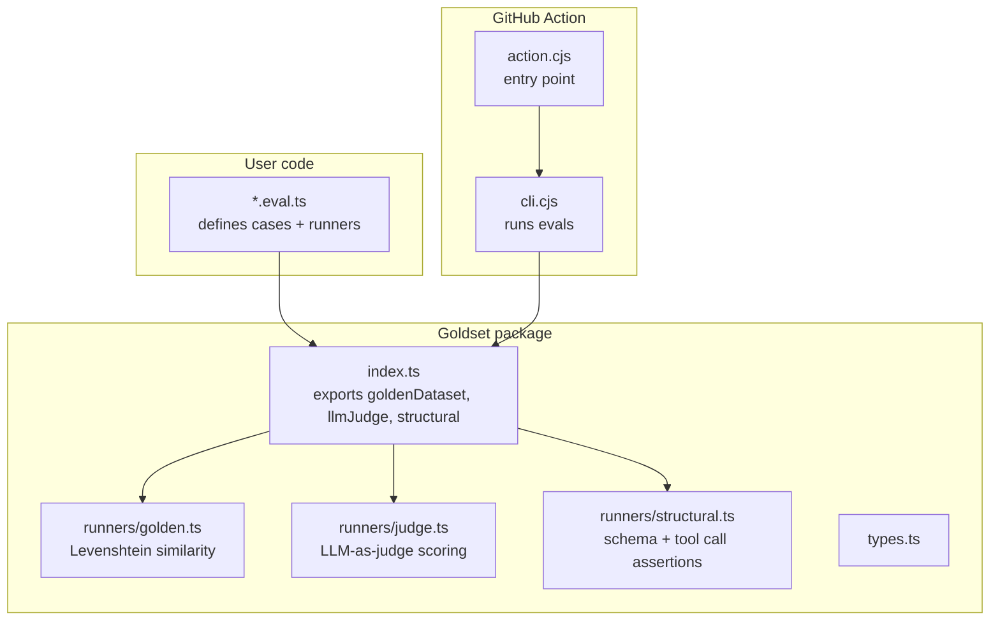
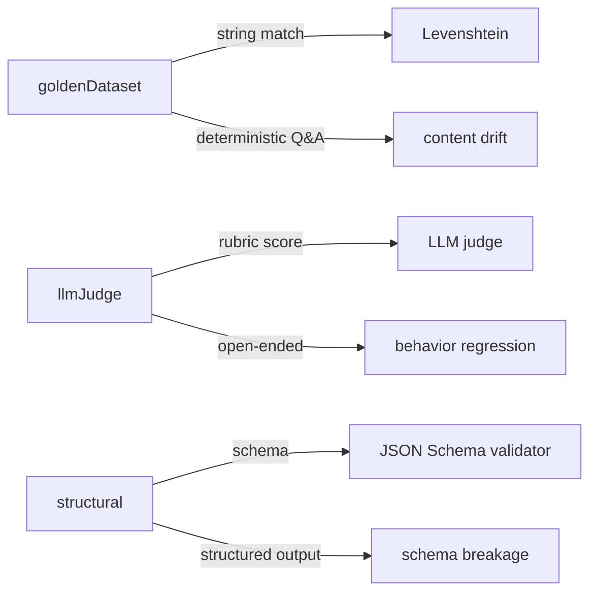
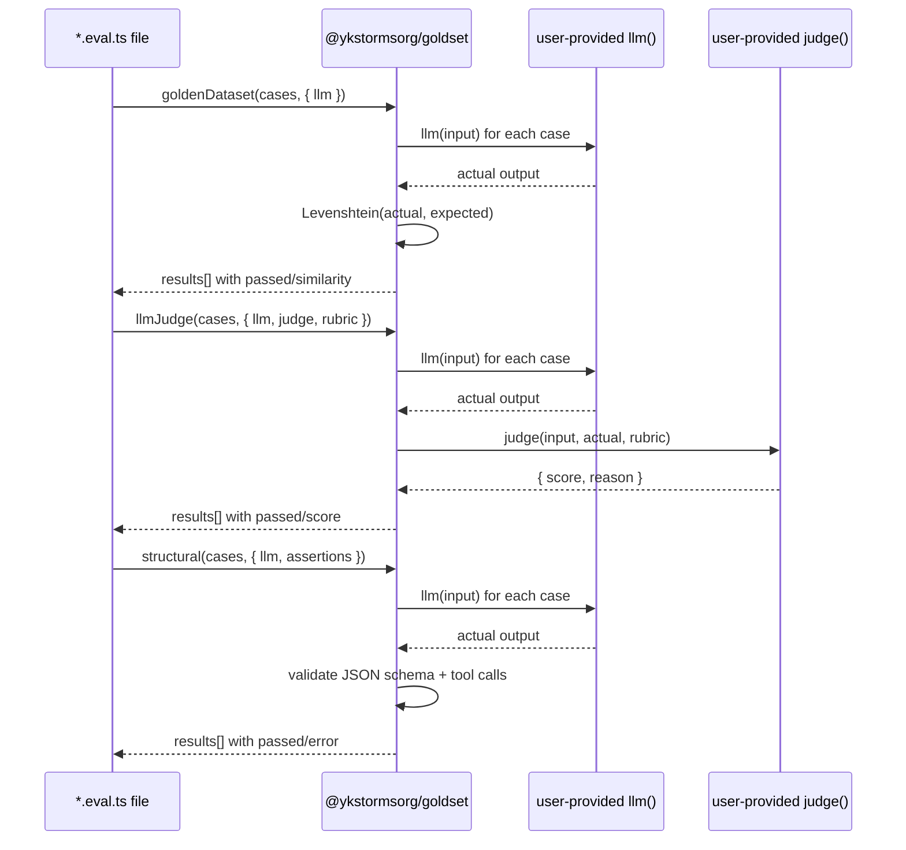

# Architecture — Goldset

## Component diagram



## Runner comparison



## Primary eval flow



## Module map

| Module | File | Exports |
|---|---|---|
| Public entry | `src/index.ts` | `goldenDataset`, `llmJudge`, `structural` |
| Golden runner | `src/runners/golden.ts` | `GoldenDatasetCase`, threshold validation, Levenshtein |
| Judge runner | `src/runners/judge.ts` | `LLMJudgeCase`, rubric scoring |
| Structural runner | `src/runners/structural.ts` | `StructuralCase`, `Assertion` union |
| Shared types | `src/types.ts` | `EvalResult`, `RunnerOptions` |
| CLI | `src/cli.ts` | `runEvals()`, `parseArgs()` |
| GitHub Action | `.github/actions/eval-report/action.cjs` | `core.setFailed()` on regression |
| Action lib | `.github/actions/eval-report/index.cjs` | PR comment posting, baseline diff |

## Type definitions

```typescript
// src/types.ts
interface EvalResult {
  passed: boolean;
  testCaseId: string;
  // runner-specific fields:
  similarity?: number;      // goldenDataset
  score?: number;           // llmJudge
  reason?: string;         // llmJudge
  error?: string;          // structural
}
```

## Design decisions

1. **Provider-agnostic llm interface** — `llm: (input: string) => Promise<string>` means any LLM works: OpenAI, Anthropic, Ollama, local models. No SDK-specific code in Goldset itself.

2. **Levenshtein over embedding similarity** — "hello world" vs "hello  world" should not fail. Normalized edit distance handles whitespace and capitalization noise.

3. **Three separate fail conditions** — `goldenDataset` fail, `llmJudge` fail, and `structural` fail are independent. A PR that passes content but breaks JSON schema is still blocked. This is intentional — each runner catches a distinct failure mode.