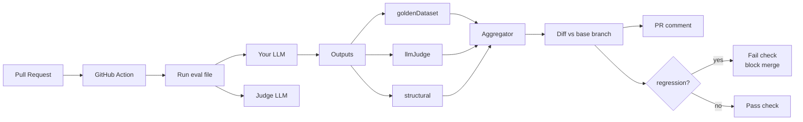

# Goldset

**Lock your AI app's behavior. Golden datasets + LLM-as-judge + structural assertions, as a GitHub Action.**

[](https://npmjs.com/package/@ykstorm/goldset)
[](https://github.com/ykstorm/goldset/actions/workflows/ci.yml)
[](LICENSE)
[](https://goldset.lakshyaraj.dev)

Docs + live playground: **[goldset.lakshyaraj.dev](https://goldset.lakshyaraj.dev)**

---

## How this started

I shipped a model bump on a quiet Tuesday — `gpt-4o-2026-03-14` to `gpt-4o-2026-04-01`. Two clicks in the OpenAI dashboard. Nothing else changed: same system prompt, same temperature, same retrieval layer.

Two weeks later, a customer pointed out our chatbot had stopped replying in Hindi. Buyers typing "Bopal mein 2BHK?" were getting paragraphs of polite English back. The new model version had a stronger English bias in the underlying weights. Nothing we could see from the outside — the API was identical, the prompts were identical.

We had unit tests for our code. We had no tests for what the LLM did. Our test suite couldn't tell us that the chatbot's behavior had changed, because we'd never written down what the behavior was supposed to be.

Goldset is the AI behavior-locking layer I built after that incident.

---

## What it is

Three runners, evals-as-code in your repo, GitHub Action that posts a PR comment with the delta and blocks the merge on regression.

| Runner | Catches | Best for |
|---|---|---|
| `goldenDataset` | Output drifted from canonical answer (Levenshtein) | FAQ, refusal correctness, deterministic Q&A |
| `llmJudge` | Behavior regression on open-ended outputs (rubric scoring) | Tone, helpfulness, brand voice, language matching |
| `structural` | Output shape broke (JSON schema, regex, contains, tool-call) | Function calling, structured generation |

You pass it your LLM function — `llm: (input) => Promise<string>`. Goldset doesn't care if it's OpenAI, Anthropic, Bedrock, Llama on Ollama, or a stub. Provider-agnostic.

For the Hindi regression: the `llmJudge` runner with a rubric like "Reply in the same language as the input. Score 5 if matched, 0 if not" would have caught it on the PR that bumped the model version, before merge.

---

## When to use Goldset and when not to

| You want this | Use |
|---|---|
| AI evals in your repo, in CI, as a PR check that can block merges | Goldset |
| A web dashboard for labeling + visualizing eval runs | Vercel Eval, Braintrust, Langfuse |
| Production observability — traces of every LLM call your app makes | Helicone, LangFuse, Logfire |
| HELM/MMLU/MT-Bench style model benchmarks | Standard benchmark harnesses |
| A managed eval SaaS with a labeling team | Scale AI, Surge AI |

Goldset is for engineers who want assertions about AI behavior next to their code. The PR comment IS the UI. If you want a dashboard with charts and a labeling queue, use Braintrust or Vercel Eval — they're great at that.

If your team already lives in CI/CD discipline, Goldset slots right in. If your team lives in dashboards, it doesn't.

---

## 60-second quickstart

```bash
npm install @ykstorm/goldset
```

```ts
// evals/customer-support.eval.ts
import { goldenDataset, llmJudge, structural } from '@ykstorm/goldset'
import { myLLM, myJudge } from '../src/llm'

const cases = [
  { id: 'refund-q', input: 'How do I get a refund?', expected: 'Email support@…' },
  { id: 'hindi-q',  input: 'Bopal mein 2BHK?',       expected: 'language: hi' },
]

await goldenDataset(cases.slice(0, 1), { llm: myLLM, threshold: 0.85 })

await llmJudge(cases.slice(1), {
  llm: myLLM,
  judge: myJudge,
  rubric: 'Score 5 if response is in the same language as the input. 0 if not.',
  passThreshold: 3,
})

await structural([{ id: 'tool-q', input: 'lookup order #42' }], {
  llm: myLLM,
  assertions: [{ type: 'tool-call-shape', toolName: 'lookupOrder', argCount: 1 }],
})
```

Run:
```bash
npx tsx evals/customer-support.eval.ts
```

## GitHub Action — the actual reason to use this

```yaml
# .github/workflows/eval.yml
- uses: ykstorm/goldset@v1
  with:
    eval-file: evals/customer-support.eval.ts
    fail-on-regression: true
    comment-on-pr: true
```

What the comment looks like on a regression PR:

| Test | Base | Head | Δ | Status |
|---|---|---|---|---|
| `refund-q` (golden) | 0.93 | 0.94 | +0.01 | ✅ pass |
| `hindi-q` (judge) | 4.2/5 | 1.8/5 | **-2.4** | ⚠️ regression |
| `tool-q` (structural) | pass | pass | — | ✅ pass |

Regression blocks the merge. Conversation happens. Either we fix the cause, or we update the expected baseline (with a commit message explaining why).

---

## Why three runners and not one

Real AI apps fail in three orthogonal ways:

1. **Facts drift.** The answer used to mention "RBI guidelines" — now it doesn't. → `goldenDataset` with Levenshtein.
2. **Tone drifts.** The answer used to be warm — now it's curt. → `llmJudge` with a rubric.
3. **Shape breaks.** The function-calling JSON used to be valid — now it's missing a field. → `structural` with JSON schema.

One runner covering all three would be a god-object. Three runners that compose are easier to reason about, easier to debug when one fails, easier to extend with a 4th someday.

You mix and match per test case. A single eval file can have all three runners hitting overlapping cases.

---

## What I'd build differently next time

- **Ship a Vitest reporter from v1.0.** Currently you call the runners imperatively. A `goldset/vitest` adapter would let teams that already live in Vitest get evals into their existing test command. v1.1.
- **Smart diffing on the GitHub Action.** Currently runs every case on every PR. With smart diffing, only cases affected by the PR's changes run. Saves API spend on big eval suites. v1.2.
- **Don't tie `llmJudge` to a single judge call per case.** Multi-shot judge averaging would reduce judge variance. v1.1.

If you're starting now, the v1.1 changes will land within two weeks of v1.0 publication.

---

## Architecture



Full sequence diagrams: [docs/architecture.md](docs/architecture.md).

---

## Roadmap

- [x] v1.0 — three runners, npm package, GitHub Action with PR comments
- [ ] v1.1 — Vitest reporter, multi-shot judge averaging
- [ ] v1.2 — smart diffing (only run affected cases)
- [ ] v1.3 — adversarial test generator (auto-create edge cases from production traffic)

Not on the roadmap: a hosted SaaS, paid tier, user accounts. Goldset stays a library.

---

## Tests + CI

```bash
npm test           # 25+ tests across the three runners
npm run build      # tsup → dist/
npm run dogfood    # runs the example eval against the included LLM stub
```

CI runs lint → typecheck → unit tests → build → dogfood. Publish to npm with provenance on git tag.

---

## Limits

- Levenshtein for `goldenDataset` is character-level. For semantic match, swap in your own distance function via the runner's hook.
- `llmJudge` is only as good as your rubric. Bad rubrics give bad scores. Iterate the rubric like you iterate the code.
- No labeling UI. Goldset is for engineers; if you need PMs labeling, use Braintrust.

---

## License

Apache License 2.0 — see [LICENSE](LICENSE).

## Provenance

Built to lock the behavior of [homesty.ai](https://homesty.ai) after the language-drift incident. ~40 cases now run on every PR across the three runners. Three production regressions caught at PR time and reverted before merge in the last two months.

## Author

**Lakshyaraj Singh Rao** — Full-Stack Engineer · AI Systems · Backend · DevOps
Mumbai, India

[lakshyaraj.dev](https://lakshyaraj.dev) · [@ykstorm](https://github.com/ykstorm) · [LinkedIn](https://linkedin.com/in/lakshyaraj) · raolakshyaraj@gmail.com
