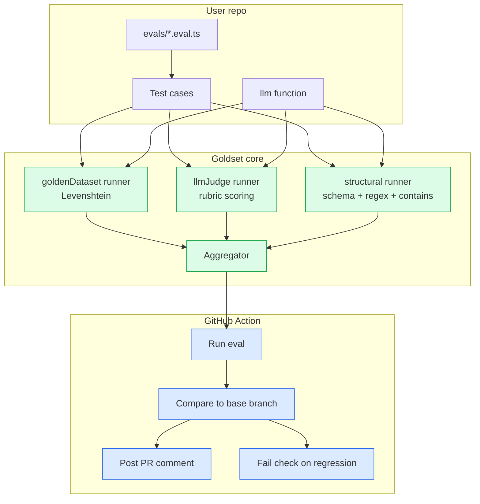
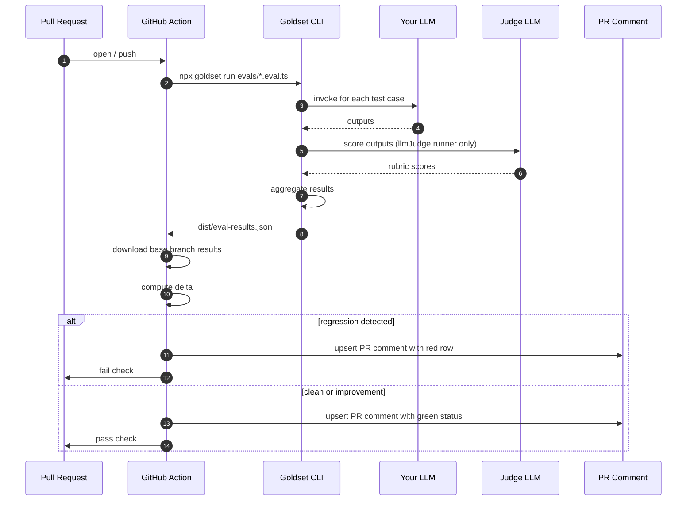
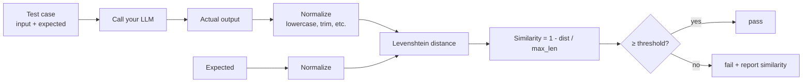
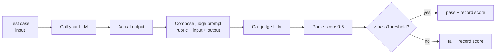
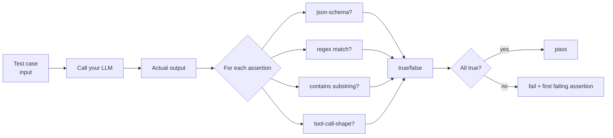

# Goldset — Architecture

## 1. Component overview



---

## 2. Eval run sequence (in CI)



---

## 3. Runner internals

### goldenDataset


### llmJudge


### structural


---

## 4. Result format

`dist/eval-results.json`:
```json
{
  "version": 1,
  "timestamp": "2026-05-26T17:00:00Z",
  "commit": "abc123",
  "branch": "feat/refund-flow",
  "runners": {
    "goldenDataset": {
      "cases": [
        {"id":"refund-q","passed":true,"similarity":0.93},
        {"id":"shipping-q","passed":false,"similarity":0.61,"threshold":0.85}
      ],
      "summary": {"passed":1,"failed":1,"passRate":0.5}
    },
    "llmJudge": {
      "cases": [
        {"id":"tone-helpful","passed":true,"score":4.2,"passThreshold":3}
      ],
      "summary": {"passed":1,"failed":0,"avgScore":4.2}
    },
    "structural": {
      "cases": [
        {"id":"output-shape","passed":false,"failedAssertion":"json-schema","reason":"missing 'intent'"}
      ],
      "summary": {"passed":0,"failed":1}
    }
  }
}
```

The GitHub Action diffs this file against the base branch's same-named file and renders the PR comment.

---

## 5. Design decisions

**Why three runners, not one?**
Because real AI apps fail in three orthogonal ways: drifted facts (golden), drifted tone (judge), drifted shape (structural). One runner that does all three would be a god-object. Three small runners compose.

**Why Levenshtein over embedding similarity for goldenDataset?**
Levenshtein is deterministic, dependency-free, and the failure mode it catches (canonical-answer drift) is character-level. Embedding similarity adds a model dependency and makes the threshold harder to reason about. We expose a hook to swap it in for cases where you need semantic match.

**Why call it `llmJudge` and not `aiScore`?**
Because "judge" makes the LLM-grading-LLM pattern explicit. Engineers reading this for the first time should immediately know what they're looking at.

**Why no UI?**
A UI is a different product. Goldset is for engineers who want evals next to their code. The PR comment IS the UI.

**Why provider-agnostic?**
Locking you to OpenAI was Vercel Eval's mistake. Your `llm: (input) => Promise<string>` is the only interface. Goldset doesn't care if it's GPT-4o, Claude, Llama 3 on Ollama, or a stub function.
