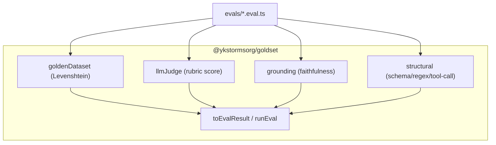
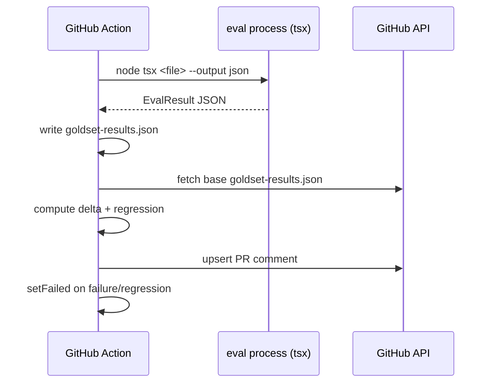

# Goldset architecture

Goldset is two things in one repo: an npm library of eval runners, and a GitHub
Action that runs a consumer's `*.eval.ts` files and gates the merge.

## Library

`src/index.ts` exports four runners and a small harness:

- `goldenDataset` (`src/runners/api.ts`, similarity in `src/runners/golden.ts`)
- `llmJudge` (`src/runners/api.ts`)
- `grounding` (`src/runners/api.ts`)
- `structural` (`src/runners/api.ts`, assertions in `src/runners/structural.ts`)
- `runEval` / `toEvalResult` — combine runner results into one `EvalResult`

Each runner takes `(cases, config)`, calls the consumer-supplied `llm` (and, for
`llmJudge`/`grounding`, a `judge`), and returns `{ runner, cases, summary }`. The
`llm` interface is just `(input: string) => Promise<string> | string`, so any
provider works.


```mermaid
graph TB
    Eval["evals/*.eval.ts"]
    subgraph runners["@ykstormsorg/goldset"]
        Gold["goldenDataset (Levenshtein)"]
        Judge["llmJudge (rubric score)"]
        Ground["grounding (faithfulness)"]
        Struct["structural (schema/regex/tool-call)"]
        Agg["toEvalResult / runEval"]
    end
    Eval --> Gold --> Agg
    Eval --> Judge --> Agg
    Eval --> Ground --> Agg
    Eval --> Struct --> Agg
```

## GitHub Action

The Action entry is `action/index.ts` (bundled to `dist/action.cjs`). It:

1. Discovers `*.eval.ts` under `eval-dir` (`action/run-evals.ts`), after
   resolving the directory under the workspace and rejecting path traversal.
2. Runs each file on the pinned `tsx` CLI (`node <tsx> <file> --output json`),
   with a per-eval timeout and an allowlisted child environment.
3. Parses each eval's JSON into a per-file row and writes the array to
   `goldset-results.json`.
4. If the event is a pull request and a token is present, fetches the base
   branch's committed `goldset-results.json`, computes the delta, and posts or
   updates one PR comment (`action/post-comment.ts`).
5. Fails the check when any eval file fails. The failure message says when one
   of them is a regression, meaning it passed on the base branch.


```mermaid
sequenceDiagram
    participant GHA as GitHub Action
    participant Eval as eval process (tsx)
    participant GH as GitHub API
    GHA->>Eval: node tsx <file> --output json
    Eval-->>GHA: EvalResult JSON
    GHA->>GHA: write goldset-results.json
    GHA->>GH: fetch base goldset-results.json
    GHA->>GHA: compute delta + regression
    GHA->>GH: upsert PR comment
    GHA->>GHA: setFailed on failure/regression
```

## Result files

Each eval prints an `EvalResult` (see [API.md](./API.md)) on stdout. The Action
collects a per-file summary array and writes it to `goldset-results.json`:

```json
[
  {
    "file": "customer-support.eval.ts",
    "passed": false,
    "summary": "goldenDataset 1/2, structural 1/1",
    "runners": {
      "goldenDataset": { "passed": 1, "failed": 1 },
      "structural": { "passed": 1, "failed": 0 }
    }
  }
]
```

The baseline is the `goldset-results.json` a consumer commits (it is tracked, not
git-ignored). The Action diffs this run against that file on the base branch.

## Design notes

- **Four runners, not one.** Drifted facts, drifted tone, unsupported claims, and
  broken output shape are different failures; each runner catches one.
- **Levenshtein, not embeddings, for `goldenDataset`.** It is deterministic and
  dependency-free, and the drift it catches is character-level. A `normalize`
  hook lets you fold in your own comparison.
- **The Action brings no model.** Each `.eval.ts` supplies its own `llm`/`judge`,
  so Goldset stays provider-agnostic.
